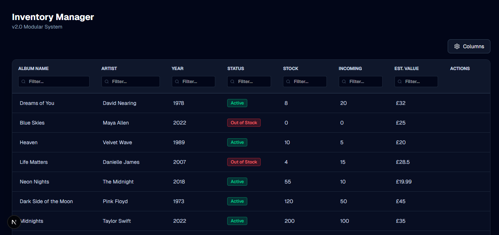

# Next.js High-Performance Data Grid

A modern, high-performance data grid built with **Next.js 14**, **TanStack Table (v8)**, and **Tailwind CSS**. 

This project demonstrates a lightweight, "headless" alternative to heavy grid libraries (like AG Grid), offering superior performance and complete UI customization.



## 🚀 Features

This grid was built to satisfy specific enterprise requirements with a focus on UX:

-   **Column Filtering:** Instant, client-side filtering input embedded directly in column headers.
-   **Dynamic Column Visibility:** Users can toggle columns on/off via a "Settings" dropdown; the grid layout adjusts instantly without layout shifts.
-   **Inline Editing:** -   Double-click any cell to edit.
    -   **Smart Inputs:** Text inputs for text data, **Dropdowns** for status fields (Active/On Hold/Out of Stock).
-   **Modern UI:** Fully styled "Dark Mode" interface (Quartz theme style) using Tailwind CSS.
-   **Optimized Performance:** Uses a headless architecture to minimize bundle size and render time.

## 🛠️ Tech Stack

-   **Framework:** Next.js (App Router)
-   **Core Logic:** @tanstack/react-table (v8)
-   **Styling:** Tailwind CSS + clsx
-   **Icons:** Lucide React

## 📦 How to Run

1.  **Clone the repository:**
    ```bash
    git clone [https://github.com/YOUR-USERNAME/enhanced-grid.git](https://github.com/YOUR-USERNAME/enhanced-grid.git)
    ```

2.  **Install dependencies:**
    ```bash
    npm install
    ```

3.  **Start the development server:**
    ```bash
    npm run dev
    ```

4.  Open [http://localhost:3000](http://localhost:3000) in your browser.

## 💡 Customization

The grid is built modularly. To modify the columns or data structure (e.g., switching from Inventory to Performance metrics), simply edit `app/columns.tsx` and `app/types.ts`.
